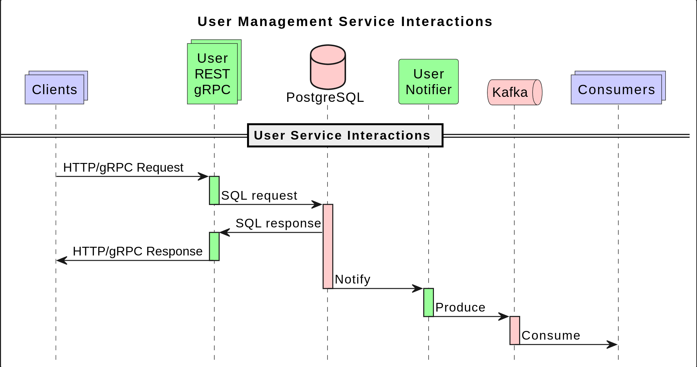
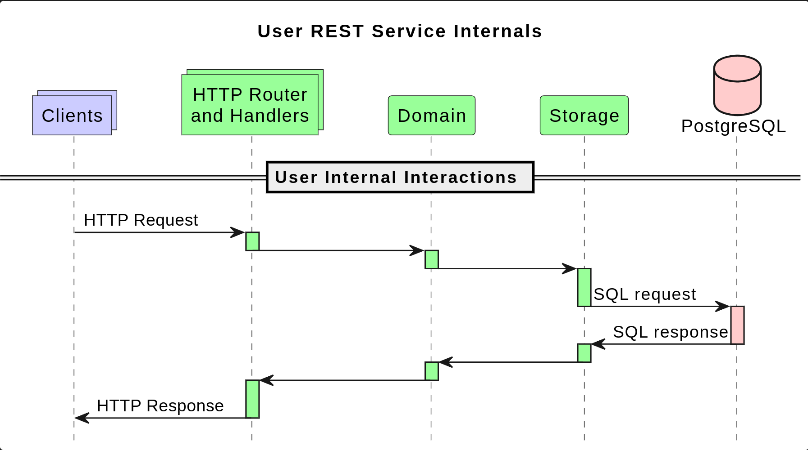
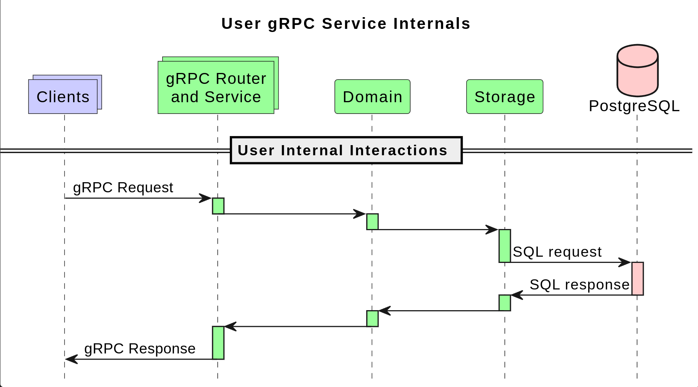

# User Management Services

This is a Go Microservice Playground project, implementing User Management Services with REST, gRPC and GraphQL APIs, PostgreSQL storage, and Kafka notifications.

Provides:

* HTTP API
  * POST /api/v1/user
  * GET /api/v1/user/:id
  * GET /api/v1/users?page=1&limit=10&country=GB
  * PUT /api/v1/user/:id with JSON body
  * DELETE /api/v1/user/:id
* gRPC/GraphQL API:
  * Create
  * User
  * Users
  * Update
  * Delete
* User change notifications via Kafka
* Health check
  * GET /health

## Tools and Dependencies

### Tools
* Go 1.23.6
* GNU Make 4.3
* Docker 27.5.1
* jq 1.6

### Dependencies
* PostgreSQL - for storing user data
* Apache Kafka - for notifying other services of user changes

## Interactions

* User HTTP/gRPC services handle user management requests
* User data stored in PostgreSQL
* Notifier notifies other services of user changes via Kafka



## Service Internals

### Packages
* [Services](./cmd) code
* [Public](./contract/) and [internal](./internal/contract/) contracts
* HTTP [server](./internal/server/http/server.go), [router](./internal/router/gin/controller.go) and [handlers](./internal/router/gin/handlers.go)  
* gRPC [server](./internal/server/grpc/server.go), [router](./internal/router/grpc/controller.go) and [handlers](./internal/router/grpc/handlers.go)  
* [Domain](./internal/domain/domain.go) - user domain logic
* [Storage](./internal/storage/postgres/storage.go) - database adapter
* [Notifier](./internal/notifier/controller.go) - user changes notifier

### Used Go Modules
* [Zerolog](https://pkg.go.dev/github.com/rs/zerolog) for logging
* [Viper](https://pkg.go.dev/github.com/spf13/viper) for configuration
* [Gin](https://pkg.go.dev/github.com/gin-gonic/gin@v1.8.1) for HTTP routing
* [Pgx](https://pkg.go.dev/github.com/jackc/pgx/v5) and [Pq](https://pkg.go.dev/github.com/lib/pq) PostgreSQL drivers for storage and notifications
* [Kafka](https://pkg.go.dev/github.com/segmentio/kafka-go) client for publishing notifications

### Interactions
#### REST


#### gRPC


### Directory Structure
```
go-userv
├── cmd
│   └── user-*
│       ├── config.go
│       ├── config.yml
│       ├── Dockerfile
│       └── main.go
├── coverage
│   └── *.html, *.xml
├── db
│   └── postgres
│       ├── migrations
│       │   └── *.sql
│       └── init.sql
├── docs
│   └── diagrams
│       └── *.puml, *.png
├── contract
│   ├── dto
│   │   └── *.go
│   └── proto
│       └── *.proto, *.pb.go
├── internal
│   ├── contract
│   │   ├── domain
│   │   │   └── *.go
│   │   ├── server
│   │   │   └── *.go
│   │   └── storage
│   │       └── *.go
│   ├── domain
│   │   └── *.go
│   ├── notifier
│   │   └── *.go
│   ├── router
│   │   ├── grpc
│   │   │   └── *.go
│   │   └── http
│   │       └── *.go
│   ├── server
│   │   ├── grpc
│   │   │   └── *.go
│   │   └── http
│   │       └── *.go
│   └── storage
│       └── postgres
│           └── *.go
├── make
│   └── *.mk
├── results
│   └── *.xml
├── scripts
│   └── *.sh
├── docker-compose.yml
├── go.mod
├── go.sum
├── Makefile
└── README.md
```

## Build System

The service build system is constructed with [GNU Make](https://www.gnu.org/software/make/) and [Docker BuildKit](https://docs.docker.com/build/buildkit/).

* [Makefile](./Makefile) and [make/*.mk](./make)
* [docker-compose.yml](./docker-compose.yml)
* [Dockerfile](./cmd/user/Dockerfile)

### Make

* Display help
  ```bash
  make help
  ```

* All - install, lint, test, coverage, build, run
  ```bash
  make all
  ```

### Step by step

* Install project
  ```bash
  make install
  ```
  * This installs required [tools and Git hooks](./make/install.mk).

* Lint
  ```bash
  make lint
  ```
  * Currently limited to Go files only, mocks_*.go excluded.

* Test
  ```bash
  make test
  ```
  * Currently limited to [router unit tests](./internal/gin/router/router_test.go)
  * Generates test [results](./results/unit-tests.xml) in JUnit XML Format, ready to be consumed by CI/CD pipelines, e.g. Jenkins, GitLab CI/CD, CircleCI, Azure DevOps, etc.

* Make coverage report
  ```bash
  make coverage
  ```
  * This generates a coverage [report](./coverage/total.html) in HTML format, try to open it in a browser

* Build docker images
  ```bash
  make build
  ```

* Run all
  ```bash
  make run
  ```
  * Runs User Service and 3rd party dependency services in Docker containers

### Logs

* All Logs
  ```bash
  docker compose logs -f
  ```

* Selective Logs
  ```bash
  docker compose logs -f user-rest
  ```
  ```bash
  docker compose logs -f user-notifier kafka
  ```
  ```bash
  docker compose logs -f user-grpc postgres
  ```

* Start dependency services only
  ```bash
  make dc-up-dependencies
  ```
  * Now you can run and debug the `user-*` service in vscode

* Kafka consumer
  In 2nd terminal
  ```bash
  ./scripts/kafka-consumer.sh
  ```
  * This allows to observe user changes

* Create, list, get, update, delete users
  In 3rd terminal:
  * REST - use UUID from the output of `list-users.sh`
    ```bash
    ./scripts/create-users.sh
    ./scripts/list-users.sh 
    ./scripts/get-user.sh UUID 
    ./scripts/update-user.sh UUID 
    ./scripts/delete-user.sh UUID
    ```
  * [gRPC](./contract/proto/GRPC.md)
  * [GraphQL](./contract/graphql/GRAPHQL.md)

* Stop
  ```bash
  make stop
  ```
  * Stops all running services

* Clean
  ```bash
  make clean
  ```
  * Stops running services, removes all containers, mocks and generated folders

* Remove docker volume
  ```bash
  docker volume rm go-userv_user-data
  ```
  * Removes the docker volume with user data in PostgreSQL database

* Health check
  ```bash
  ./scripts/health-check.sh
  ```
  * Returns health status of the User Service

### TODO
* Integration tests
* More unit tests
* Snyk
* API annotaions and documentation
* Telemetry
